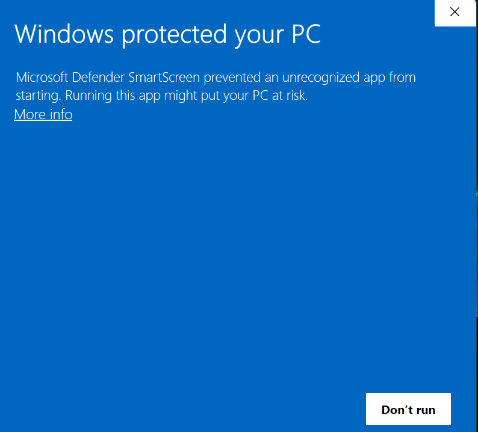
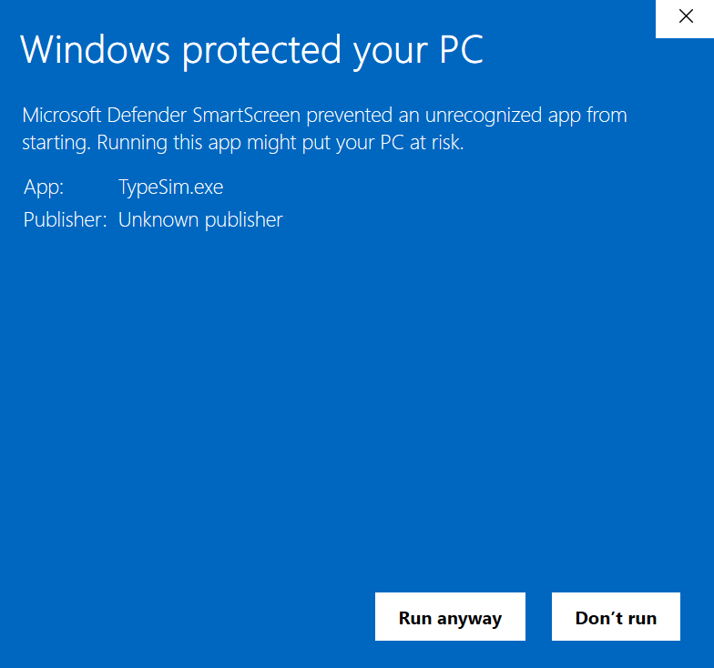
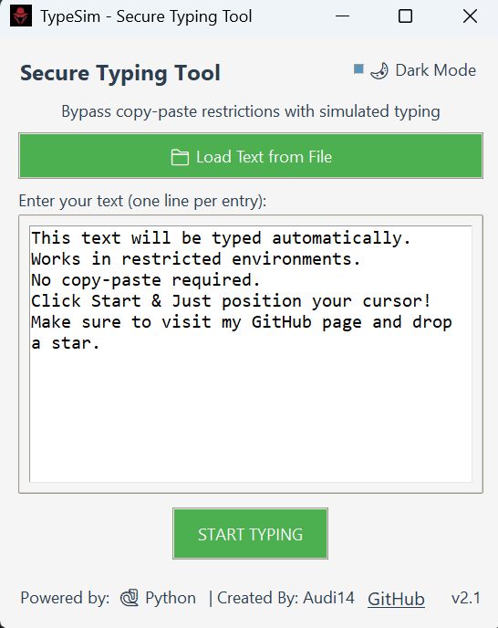

# 👩🏻‍💻 TypeSim – Secure Typing Tool

## ✨ Introduction

**TypeSim** is a cross-platform GUI tool that simulates human-like typing behavior, helping you bypass copy-paste restrictions by typing your text automatically.

> 🧠 Ideal for restricted environments like VMs, remote desktops, or software that blocks clipboard operations.

## 📦 What's Inside the Repo?

✅ No installation required  
⚙️ Fully standalone build  
🖥️ Works out-of-the-box on Windows  
🔒 No dependencies

---

## 🛠️ First-Time Setup (Important)

When you launch **TypeSim.exe** for the first time, Windows Defender SmartScreen may block it, as it's from an unknown publisher.

  
   
  <strong>Step 1:</strong> Click <code>More Info</code>

  
   
  <strong>Step 2:</strong> Click <code>Run Anyway</code>

> ✅ After that, it runs normally. Windows remembers your choice.

---

## 🖥️ Using TypeSim – GUI Breakdown

  

### Features:
- 💡 **Load Text from File**: Import a list of lines to type.
- 🎯 **Text Area**: Type or paste content manually, one line per entry.
- 🧠 **Dark Mode Toggle**: Enable/disable dark UI.
- 🧩 **Start Typing**: Simulates typing wherever your cursor is placed.

> Example Text:
This text will be typed automatically.
Works in restricted environments.
No copy-paste required.
Click Start & Just position your cursor!
Make sure to visit my GitHub page and drop a star.

---

## 📎 How It Works

- Uses `pyautogui` to simulate keypresses.
- Works on most text fields including terminals, IDEs, editors, etc.
- Can bypass **copy-paste disabled** areas.

---

## 🧠 Tips

- Make sure the cursor is **focused in a text field** before clicking **Start Typing**.
- To stop mid-way, press `Esc` or move the cursor out.
- You can add delays or tweak behavior by editing the source before building.
---
## 📁 Developer Notes

- Built using: `Python`, `Tkinter`, `PyInstaller`
- Works on: **Windows**
- OnProgress: **Linux**
---
## 🔐 Disclaimer
> This tool is for educational and productivity purposes only. Please use it responsibly and ethically.
---
## ⭐ Like it? Support by Giving a Star!

---

## 👨‍💻 Author

Created by **Audi14**  
[GitHub](https://github.com/Audi14-2005) | [LinkedIn](https://www.linkedin.com/in/monic-auditya-a-b8bb68295/)
